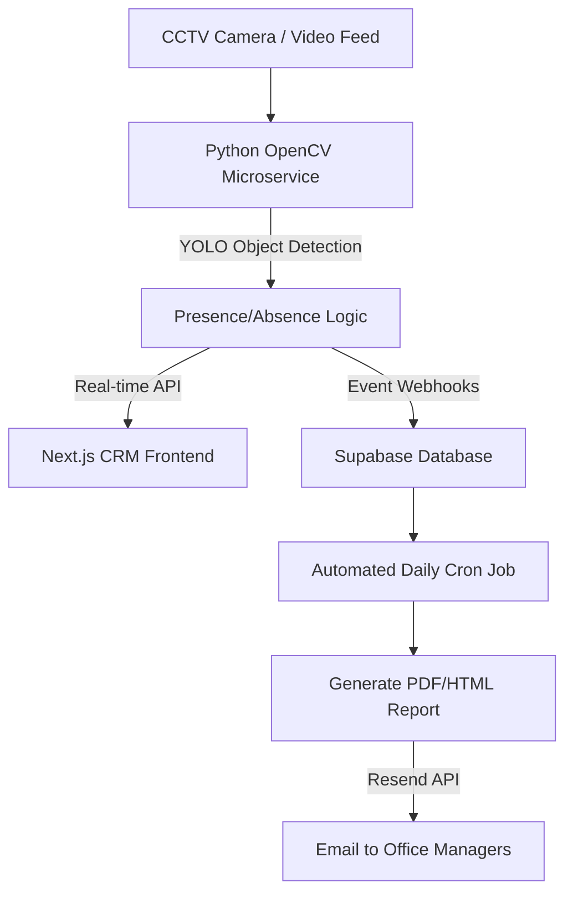

# CCTV Employee Tracking & Daily Auto System Report Master Plan

## 🎯 Goal

Integrate the Python/OpenCV-based Employee Tracking System into the GT CRM Web Project to provide **real-time CCTV monitoring** and generate **daily automated attendance reports** based on employee presence detection.

---

## 🏗️ Architecture Overview

The system will bridge the gap between the physical office environment and the digital CRM, automatically tracking when employees are at their desks and generating management reports.

---

## 🚀 Key Features

### 1. Real-Time CCTV Monitoring (Next.js Dashboard)

- A new route `/cctv-monitoring` in the Next.js CRM.
- Live video feed embedded via MJPEG streaming from the Python service.
- Visual overlays showing the monitoring area (Green box), employee presence (Red box), and absence (Blue box).
- Accessible only to **Super Admins** and **Office Managers**.

### 2. Intelligent Presence Tracking

- Uses YOLOv4-tiny AI model to identify persons in designated workstation areas.
- Configurable "Absence Threshold" (e.g., if a person leaves the desk for >5 minutes, log as "Absent").
- Emits events to the Supabase Database whenever an employee transitions between "Present" and "Absent".

### 3. Daily Auto System Reports

- **Data Collection**: The system logs every presence/absence event into a new Supabase table (`employee_tracking_logs`).
- **Cron Job**: A scheduled function (e.g., using Supabase `pg_cron` or Vercel Cron) runs every day at 12:00 AM (end of workday).
- **Report Generation**: Aggregates the data to calculate:
  - Total time at desk (Productive hours)
  - Total time absent
  - Number of desk-leaving events
- **Email Delivery**: Uses the existing Resend API integration to email a beautiful summary report to the Office Manager.

---

## 🛠️ Implementation Steps

### Phase 1: Backend Setup (Python Microservice)

1. **Service Creation**: Move the `temp_cctv_project` code into `services/cctv_tracker`.
2. **Port Configuration**: Update the Flask app to run on **Port 5001** (avoiding conflict with LibreTranslate on Port 5000).
3. **Docker Integration**: Add the `cctv_tracker` service to the root `docker-compose.yml` for unified local development.

### Phase 2: Supabase Database Integration

1. **New Schema Tables**:
   - `employee_workstations`: Maps CCTV camera coordinates to specific employees.
   - `employee_tracking_logs`: Records timestamps of "Present" and "Absent" statuses.
2. **Webhook / API Link**: Modify `employee_tracking_fixed.py` to send HTTP POST requests (or use Supabase Python Client) to record status changes into the database.

### Phase 3: Frontend Development (Next.js)

1. **CCTV Dashboard Page**: Create `src/app/cctv-monitoring/page.jsx` | Access via `http://localhost:3005/cctv`.
2. **Live Feed Component**: Implement an `` tag that consumes the `http://localhost:3005/video_feed` MJPEG stream.
3. **Controls**: Add UI elements to start/stop tracking, adjust confidence thresholds, and view live AI confidence scores.
4. **Navigation**: Add the CCTV dashboard link to the CRM `Sidebar.jsx` or `Sidebarv2.jsx `.

### Phase 4: Daily Auto Reporting System

1. **Cron Job Configuration**: Setup Vercel Cron or Supabase `pg_cron` to trigger the daily summary endpoint.
2. **Aggregation Logic**: Write a Next.js API route (`/api/cron/daily-attendance`) that queries `employee_tracking_logs` and summarizes the data.
3. **Email Template**: Design a responsive HTML email template for the attendance report.
4. **Resend Delivery**: Trigger Resend API to dispatch the email to relevant Office Managers.

---

## ❓ User Review Required

> [!IMPORTANT]
>
> - **Employee Mapping**: Currently, the YOLO model detects "a person". To generate accurate daily reports for specific employees, we need a way to map a specific desk/camera to a specific employee in the database. Are you okay with assigning 1 camera/desk area per employee to achieve this?
>   answer: now one camera can cover all 4-6 employees desk area, also we can add more cameras
> - **Video Source**: For production, will you use RTSP IP cameras for the live feed, or do you have a different video input method planned?
>   answer: only live feed from cctv no video recording in cloud or local
