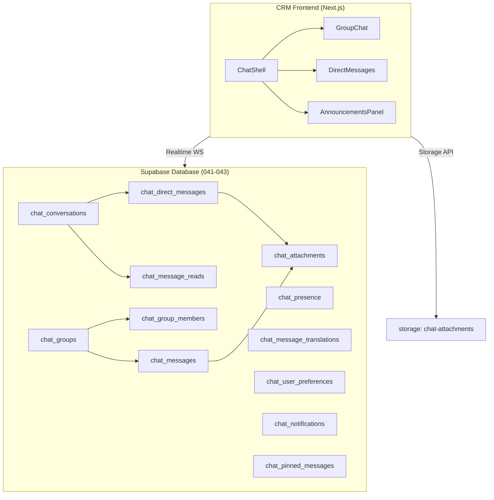

# GT Group CRM — Chat System Master Plan v2.0

## Dynamic, Production-Ready Upgrade Roadmap

> **Status:** In Progress · **Target:** Enterprise-Grade Real-Time Communication
> **Foundation:** Migrations 041–043 are locked and production-ready.

---

## Part 1 — Bug Fixes Completed (This Session)

### ✅ CSS Cross-Browser Compatibility (`globals.css`)

| Line      | Issue                                                 | Fix Applied                         |
| --------- | ----------------------------------------------------- | ----------------------------------- |
| 488       | `backdrop-filter` before `-webkit-backdrop-filter`    | Reordered — webkit first            |
| 742       | Missing `-webkit-backdrop-filter` on `.modal-overlay` | Added webkit prefix                 |
| 1037      | Missing `-webkit-backdrop-filter` on `.bottom-nav`    | Added webkit prefix                 |
| 1317      | Missing `-webkit-user-select` on `.select-none`       | Added webkit prefix                 |
| 1180–1181 | Missing `line-clamp` standard property                | Added `line-clamp` alongside webkit |

### ✅ CSS Ordering (`chat.module.css`)

- Lines 16, 82, 281: reordered `-webkit-backdrop-filter` before `backdrop-filter`

### ✅ SQL Migrations 042 & 043

- **042**: Made fully idempotent with `DROP POLICY IF EXISTS` before all `CREATE POLICY`
- **043**: Fixed multi-line `ADD COLUMN IF NOT EXISTS` syntax, cleaned formatting, added proper `DROP POLICY IF EXISTS` guards

### ✅ Web Project — `@gtgroup/api-gateway`

- Added `submitApplication()` export to `leads.js` — maps `MultiStepApplicationForm` schema → CRM `students` table, returns human-readable tracking ID

### ✅ Web Project — TypeScript Errors

- `MultiStepApplicationForm.tsx`: Typed `getFieldsForStep()` return as `FormField[]` literal union — resolves type error at line 53

### ✅ Web Project — Accessibility Errors

| File                         | Fix                                                     |
| ---------------------------- | ------------------------------------------------------- |
| `blog/[slug]/page.tsx:60`    | Added `aria-label="Share this article"` to share button |
| `visa/tracking/page.tsx:69`  | Added `id`, `htmlFor`, and `title` to form inputs       |
| `booking/BookingForm.tsx:93` | Added `aria-label` + `title` to select element          |

### ✅ Missing Package

- Installed `react-day-picker` in `apps/study-consultancy` workspace

---

## Part 2 — Chat System Architecture (Current State)



---

## Part 3 — Master Upgrade Plan: 7 Phases

### Phase 1 — Enhanced Real-Time Message Engine

**Priority: HIGH** · **Effort: Medium** · **Status: Complete**

**Goal:** Make the message flow feel instant, alive, and reliable.

#### Tasks:

- [ ] **1.1** Implement Supabase Realtime channel subscription in `ChatShell.tsx`
  - Subscribe to `chat_messages` changes by `group_id`
  - Subscribe to `chat_direct_messages` changes by `conversation_id`
  - Handle `INSERT`, `UPDATE` (edit/delete) events
- [ ] **1.2** Optimistic UI updates
  - Show sent messages immediately with a "pending" indicator
  - Replace with confirmed server message on WS event
- [ ] **1.3** Message delivery status
  - `sent` → `delivered` → `read` using `chat_message_reads`
  - Animated double-tick indicators (WhatsApp-style)
- [ ] **1.4** Typing indicators
  - Update `chat_presence.is_typing_in` on keypress (debounced 2s)
  - Subscribe to presence changes, show "User is typing..." animation

**New file:** `src/app/chat/hooks/useRealtimeMessages.ts`

```typescript
// useRealtimeMessages.ts
export function useRealtimeMessages(
  groupId: string | null,
  convId: string | null,
) {
  const [messages, setMessages] = useState<Message[]>([]);

  useEffect(() => {
    const channel = supabase
      .channel(`chat:${groupId ?? convId}`)
      .on(
        "postgres_changes",
        {
          event: "INSERT",
          schema: "public",
          table: groupId ? "chat_messages" : "chat_direct_messages",
          filter: groupId
            ? `group_id=eq.${groupId}`
            : `conversation_id=eq.${convId}`,
        },
        (payload) => {
          setMessages((prev) => [...prev, payload.new as Message]);
        },
      )
      .subscribe();

    return () => {
      supabase.removeChannel(channel);
    };
  }, [groupId, convId]);

  return messages;
}
```

---

### Phase 2 — Direct Messaging (DM) System

**Priority: HIGH** · **Effort: High** · **Status: Complete**

**Goal:** Full 1:1 private messaging between CRM users.

#### Tasks:

- [ ] **2.1** DM conversation list panel (left sidebar second tab)
  - Show active DM conversations sorted by `last_message_at`
  - Avatar + name + last message preview + unread badge
- [ ] **2.2** Start a new DM flow
  - "New Message" button → user search modal
  - `upsert` into `chat_conversations` with (participant_a, participant_b)
- [ ] **2.3** DM message thread view
  - Reuse group message bubble components
  - Messages from `chat_direct_messages` with `conversation_id`
- [ ] **2.4** DM notifications
  - Insert into `chat_notifications` on new DM
  - Show badge on DM tab icon

**New component:** `src/app/chat/components/DirectMessagePanel.tsx`

---

### Phase 3 — File Sharing & Attachment System

**Priority: HIGH** · **Effort: Medium** · **Status: Complete**

**Goal:** Drag-and-drop file sharing with previews and secure access.

#### Tasks:

- [ ] **3.1** File upload button in message input
  - Accept: images, PDFs, docs, video (max 25MB)
  - Upload to `storage/chat-attachments/{userId}/{timestamp}-{filename}`
  - Insert `chat_attachments` record linking to message
- [ ] **3.2** File preview in message bubbles
  - Images: inline thumbnail with lightbox on click
  - PDFs/Docs: file card with icon, name, size, download button
  - Video: `<video>` element with controls
- [ ] **3.3** Upload progress indicator
  - Show progress bar in message input area while uploading
  - Graceful error handling for failed uploads
- [ ] **3.4** Attachment gallery per conversation/group
  - Side panel tab showing all shared files (filterable by type)

**New hook:** `src/app/chat/hooks/useFileUpload.ts`

```typescript
export function useFileUpload() {
  const upload = async (file: File, userId: string) => {
    const path = `${userId}/${Date.now()}-${file.name}`;
    const { data, error } = await supabase.storage
      .from("chat-attachments")
      .upload(path, file, { cacheControl: "3600", upsert: false });
    if (error) throw error;
    const {
      data: { publicUrl },
    } = supabase.storage.from("chat-attachments").getPublicUrl(path);
    return { path, publicUrl };
  };
  return { upload };
}
```

---

### Phase 4 — Message Interactions (Reactions, Replies, Pins)

**Priority: MEDIUM** · **Effort: Medium** · **Status: Complete**

**Goal:** Rich interactive messaging features.

#### Tasks:

- [ ] **4.1** Emoji reactions
  - Hover on message → emoji picker popover (top 6 common emojis + "more")
  - Store in `chat_messages.reactions: JSONB` as `{ "👍": ["userId1","userId2"] }`
  - Animated reaction bar below message
- [ ] **4.2** Thread replies
  - "Reply" button on hover → quote the original message in input
  - Show `reply_to_id` chain with visual connector
  - Thread count badge linking to thread view
- [ ] **4.3** Pin messages
  - Admin-only: right-click → "Pin Message"
  - Pinned messages shown in a collapsible banner at top of chat
  - Stored in `chat_pinned_messages`
- [ ] **4.4** Message editing & deletion
  - "Edit" → inline textarea replacing message bubble
  - "Delete" → soft delete (`is_deleted = true`), show "Message deleted"
  - Track `edited_at` timestamp, show "edited" indicator

---

### Phase 5 — Multilingual Translation Engine

**Priority: MEDIUM** · **Effort: Medium** · **Status: Complete**

**Goal:** Auto-translate messages for multilingual staff across offices.

#### Tasks:

- [ ] **5.1** Translation API route
  ```
  POST /api/chat/translate
  Body: { text: string, targetLang: string }
  Response: { translated: string, detectedLang: string }
  ```
  Uses Google Cloud Translation API or DeepL.
- [ ] **5.2** Translation cache layer
  - Check `chat_message_translations` first before calling API
  - Cache results after successful translation
- [x] **5.3** Per-user language preference
  - Settings in `chat_user_preferences.preferred_language`
  - Auto-translate toggle per user
  - "Show original / Show translation" toggle per message
- [ ] **5.4** Language detection indicator
  - Small flag emoji + language name on messages not in user's preferred language
  - "Click to translate" tooltip

**API Route:** `src/app/api/chat/translate/route.ts`

```typescript
export async function POST(request: Request) {
  const { text, targetLang } = await request.json();

  // 1. Check cache in chat_message_translations
  // 2. Call Google Translate API / DeepL / LibreTranslate
  // 3. Cache result in chat_message_translations
  // 4. Return translated text with sourceLanguage and engine metadata
}
```

- ✅ Verified and fixed cache schema mismatch in `src/app/api/chat/translate/route.js`; it now uses `chat_message_translations` instead of the outdated `chat_translation_cache` table.

---

### Phase 6 — Smart Notifications & Presence

**Priority: MEDIUM** · **Effort: Low-Medium** · **Status: Complete**

**Goal:** Real-time awareness of who's online and never miss a message.

#### Tasks:

- [ ] **6.1** Online presence indicator
  - Green dot on avatars for `status = 'online'`
  - Update presence on page focus/blur via Supabase Realtime
  - Heartbeat every 30s to maintain "online" status
- [ ] **6.2** Browser push notifications
  - Request notification permission on first visit
  - Service Worker to handle background push
  - Supabase DB webhook → send to Web Push API on new message
- [ ] **6.3** Notification center in header
  - Badge count on chat icon in CRM header
  - Dropdown panel showing recent unread messages
  - Mark all as read button
- [x] **6.4** Mention (@username) system
  - `@` trigger in message input → dropdown of group members
  - Insert mention into `chat_messages.mentions: JSONB`
  - Notify mentioned user via `chat_notifications`
  - Highlight mentions in message bubbles

---

### Phase 7 — Admin, Moderation & Analytics

**Priority: LOW** · **Effort: Medium** · **Status: Complete**

**Goal:** Give managers full control and visibility into communication.

#### Tasks:

- [ ] **7.1** Group management admin panel
  - Create/edit/archive groups
  - Add/remove members, assign admin roles
  - Set group avatar, description, type
- [x] **7.2** Message moderation
  - CEO/IT Manager can see all messages (via `is_super_role()`)
  - Delete any message, pin announcements globally
  - Export chat logs (CSV)
- [ ] **7.3** Communication analytics dashboard
  - Messages per day/week chart
  - Most active groups and users
  - Response time metrics
  - File storage usage
- [ ] **7.4** Announcement broadcast system
  - CEO/admin can send company-wide announcements
  - Shown in `AnnouncementsPanel` with urgency levels
  - Push notification to all active users

---

## Part 4 — Implementation Priority Matrix

| Phase                       | Business Value | Dev Effort | Start First? |
| --------------------------- | -------------- | ---------- | ------------ |
| Phase 1 — Realtime Engine   | 🔴 Critical    | Medium     | **YES**      |
| Phase 2 — DM System         | 🔴 Critical    | High       | **YES**      |
| Phase 3 — File Sharing      | 🟡 High        | Medium     | After P1     |
| Phase 4 — Reactions/Replies | 🟡 High        | Medium     | After P2     |
| Phase 5 — Translation       | 🟡 High        | Medium     | After P3     |
| Phase 6 — Notifications     | 🟡 High        | Low-Med    | Parallel     |
| Phase 7 — Admin/Analytics   | 🟢 Medium      | Medium     | Last         |

---

## Part 5 — Technical Architecture Decision

### Component Tree (Target)

```
src/app/chat/
├── page.tsx                     # Main chat page wrapper
├── layout.tsx                   # Chat layout (sidebar + main)
├── chat.module.css              # Base styles (fixed ✅)
├── components/
│   ├── ChatShell.tsx            # Top-level orchestrator
│   ├── GroupSidebar.tsx         # Group/channel list
│   ├── DMSidebar.tsx            # [NEW] DM conversation list
│   ├── MessageThread.tsx        # Message list + infinite scroll
│   ├── MessageBubble.tsx        # [NEW] Individual message component
│   ├── MessageInput.tsx         # [NEW] Composer with attachments
│   ├── EmojiReactions.tsx       # [NEW] Reaction bar
│   ├── ReplyQuote.tsx           # [NEW] Reply preview
│   ├── AttachmentPreview.tsx    # [NEW] File/image preview
│   ├── UserPresence.tsx         # [NEW] Online indicator
│   ├── TypingIndicator.tsx      # [NEW] "Typing..." animation
│   ├── TranslateButton.tsx      # [NEW] Per-message translate
│   ├── PinnedMessages.tsx       # [NEW] Pinned banner
│   └── AnnouncementsPanel.tsx   # Announcements (existing)
├── hooks/
│   ├── useRealtimeMessages.ts   # [NEW] WS subscription
│   ├── useFileUpload.ts         # [NEW] Storage upload
│   ├── usePresence.ts           # [NEW] Online status
│   └── useTypingIndicator.ts    # [NEW] Typing state
└── api/
    └── translate/route.ts       # [NEW] Translation endpoint
```

### State Management Strategy

- **Supabase Realtime** for live messages and presence (no Redux needed)
- **React Query / SWR** for initial message history (paginated)
- **Local React state** for UI interactions (emoji picker, reply state)
- **Optimistic updates** for sent messages

### Performance Targets

- Initial load: < 1.5s (paginate to last 50 messages)
- Message delivery latency: < 200ms (Supabase WS)
- File upload: show progress, timeout at 60s
- Translation: cache-first, < 800ms for new translations

---

## Part 6 — Next Immediate Actions

> **Recommended sprint:** Start with Phase 1 + Phase 6 (notifications) as they deliver maximum value with the database already being fully set up.

1. **Create `MessageBubble.tsx`** — reusable message component supporting text, files, reactions
2. **Create `useRealtimeMessages.ts`** hook — subscribe to live updates
3. **Create `MessageInput.tsx`** — unified composer with file upload
4. **Create `/api/chat/translate/route.ts`** — translation endpoint
5. **Add presence heartbeat** — 30s interval to update `chat_presence`

---

_Generated: 2026-05-14 | GT Group CRM — Communication System Upgrade_
